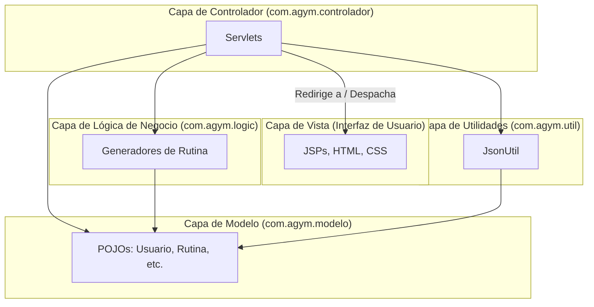

```mermaid
graph TD
    direction LR

    subgraph "Capa de Vista (Interfaz de Usuario)"
        Vista["JSPs, HTML, CSS"]
    end

    subgraph "Capa de Controlador (com.agym.controlador)"
        Controlador["Servlets"]
    end

    subgraph "Capa de Lógica de Negocio (com.agym.logic)"
        Logica["Generadores de Rutina"]
    end

    subgraph "Capa de Utilidades (com.agym.util)"
        Utilidades["JsonUtil"]
    end

    subgraph "Capa de Modelo (com.agym.modelo)"
        Modelo["POJOs: Usuario, Rutina, etc."]
    end

    %% --- Dependencias entre Capas ---
    Controlador --> Logica
    Controlador --> Utilidades
    Controlador --> Modelo
    Controlador -- "Redirige a / Despacha" --> Vista

    Logica --> Modelo
    Utilidades --> Modelo
```
