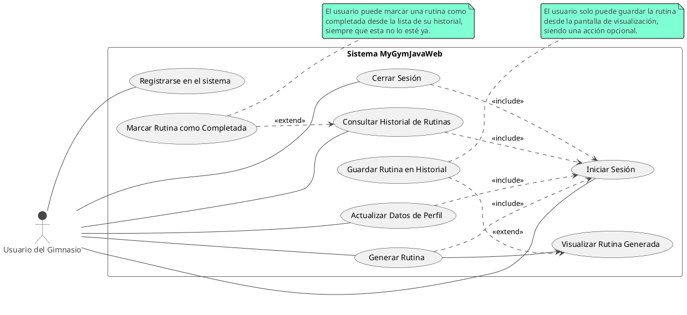

¡Absolutamente! Aquí tienes una versión más completa y formal del diagrama de casos de uso, creada con la sintaxis de **PlantUML**.

Esta versión es más detallada porque:
1.  Utiliza las relaciones `<<include>>` y `<<extend>>` de UML de una manera más estricta para definir flujos obligatorios y opcionales.
2.  Desglosa el proceso de "Generar Rutina" en "Generar" y "Visualizar" para aclarar dónde ocurren las extensiones.
3.  Añade notas contextuales para explicar las interacciones clave.

Aquí tienes el código PlantUML. Puedes compilarlo en cualquier herramienta compatible (como el servidor online de PlantUML, o en editores como VS Code con la extensión de PlantUML).

### Explicación de esta Versión "Más Completa":

*   **`include` vs `extend`:** Este diagrama distingue claramente entre `<<include>>` (una dependencia obligatoria, como tener que iniciar sesión para generar una rutina) y `<<extend>>` (una funcionalidad opcional, como decidir guardar una rutina después de verla). Esto es mucho más preciso desde el punto de vista de UML.
*   **Flujo Lógico:** La flecha sólida `UC_Generate --> UC_ViewRoutine` muestra una secuencia directa e inevitable: el sistema siempre te muestra la rutina justo después de crearla. Esto aclara el flujo de la aplicación.
*   **Contexto con Notas:** Las notas explican en lenguaje natural las reglas de negocio o las condiciones bajo las cuales se activan los casos de uso opcionales, añadiendo una capa de detalle que el diagrama por sí solo no puede transmitir.

Esta versión en PlantUML es un documento de análisis de requisitos mucho más robusto y formal.
